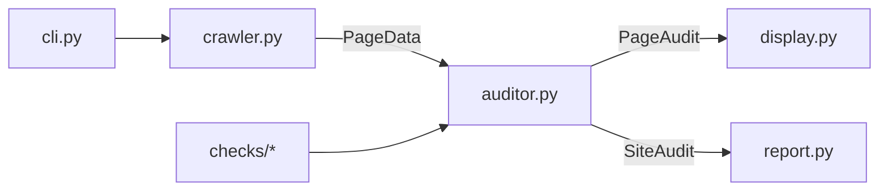

# SEObuddy

[](https://pypi.org/project/seobuddy/)
[](https://pypi.org/project/seobuddy/)
[](LICENSE)

A Python CLI that crawls a website and runs a **technical SEO audit**. You get live progress and scores in the terminal, plus a **Markdown report** you can open in any editor or share with your team.

> **Note:** This is an open-source **technical SEO audit CLI**, not affiliated with the commercial product at [seobuddy.com](https://seobuddy.com/).

## Documentation

Full manuals (same content as below, in more detail):

- [User Manual](docs/USER_MANUAL.md) — installation, usage, reading results, troubleshooting
- [Technical Manual](docs/TECHNICAL_MANUAL.md) — architecture, modules, scoring, tests, extension points
- [Report Example](docs/REPORT_EXAMPLE.md) — sample terminal summary and Markdown report (`google.com` audit)
- [Publishing](docs/PUBLISHING.md) — PyPI releases (manual upload and GitHub Actions)

## Features

- **Async BFS crawler** — configurable depth, same-domain internal links only, deduplicated URLs
- **11 weighted per-page categories** — title, meta, Open Graph, JSON-LD, headings, content, links, images, canonical, hreflang, technical
- **Site-wide checks** — robots.txt validation and crawl enforcement, XML sitemap audit with coverage metrics
- **Per-page and site scores** — 0–100 with weighted category averages and letter grades
- **Rich terminal UI** — progress bars, color-coded scores, live per-page results, final summary panel
- **Markdown reports** — executive summary, score breakdown, page-by-page findings, prioritized recommendations

## Requirements

- Python 3.11+

## Quick start

### 1. Install

**From PyPI** (recommended — no clone or GitHub URL required):

```bash
pip install seobuddy
# or, for an isolated global CLI (recommended on macOS/Linux):
pipx install seobuddy
```

**From source** (contributors / development):

```bash
git clone https://github.com/nikitaycs50/SEObuddy.git
cd SEObuddy
python3 -m venv .venv
source .venv/bin/activate   # Windows: .venv\Scripts\activate
pip install -e .
```

Confirm the command is available:

```bash
seobuddy --help
```

Upgrade an existing install:

```bash
pip install -U seobuddy
# or: pipx upgrade seobuddy
```

### 2. Run a simple audit

```bash
seobuddy https://nikitay.com
```

Defaults: crawl **depth 2** (homepage plus two link hops), **5** parallel requests, **10** second timeout, report written to the current directory.

### 3. Read the results

- Watch the **terminal** for per-page scores and a final summary table.
- Open the generated file `yyyymmddhhmm-<hostname>-report.md` (for example `202606041408-nikitay.com-report.md`).

## Usage

```bash
seobuddy <URL> [OPTIONS]
```

### Arguments

| Argument | Description |
|----------|-------------|
| `URL` | Full site URL to audit (`https://` recommended). Bare domains like `nikitay.com` are normalized to `https://`. |

### Options

| Option | Default | Description |
|--------|---------|-------------|
| `--depth` | `2` | Link hops from the seed URL. `0` = seed page only. |
| `--max-pages` | `50` | Stop crawling after this many pages (avoids huge sites). |
| `--concurrency` | `5` | Maximum parallel HTTP requests during the crawl. |
| `--timeout` | `10` | Per-request timeout in seconds. |
| `--output-dir` | `.` | Folder where the Markdown report is saved. |
| `--user-agent` | Chrome 131 (desktop) | HTTP User-Agent on every request. Default mimics Chrome for compatibility; override to identify SEObuddy if required. |
| `--no-color` | off | Plain terminal output (no Rich colors). |

### Examples

```bash
# Default crawl (depth 2)
seobuddy https://example.com

# Homepage only (fast check)
seobuddy https://nikitay.com --depth 0

# Deeper crawl, more parallelism
seobuddy https://nikitay.com --depth 2 --concurrency 10

# Save reports to a folder
seobuddy https://nikitay.com --output-dir ./reports

# CI / logs (no colors)
seobuddy https://nikitay.com --no-color

# Custom User-Agent (default is Chrome-like)
seobuddy https://nikitay.com --user-agent "SEObuddy/0.2.0 (+https://nikitay.com)"

# Module entry point
python -m seobuddy https://nikitay.com
```

### Verified example: nikitay.com

| URL | Result |
|-----|--------|
| `https://nikitay.com` | Works — crawls the site, prints scores, writes a report |
| `https://niktiay.com` | **Fails** — hostname does not resolve (typo: missing **k** in *nikitay*) |

After `seobuddy https://nikitay.com --depth 1` you should see: startup banner, progress bar, one line per page, **SITE AUDIT COMPLETE** panel, and a report file in the output directory.

## Understanding the terminal output

### Startup banner

Shows version, target URL, crawl depth, concurrency, and the User-Agent in use (Chrome desktop by default).

### Live progress

Spinner, **current URL**, progress bar, and elapsed time.

### Per-page line

```text
█████░░░ 63/100  /  — title ✗  meta ~  og ✓  h1 ✓
```

| Symbol | Meaning |
|--------|---------|
| `█` / `░` | Visual score bar |
| `63/100` | Weighted page score |
| `/` or `/path` | URL path audited |
| `✓` | Category passed (score ≥ 80) |
| `~` | Category warning (60–79) |
| `✗` | Category failed (&lt; 60) |

### Score colors

| Score | Color |
|-------|-------|
| 80–100 | Green |
| 60–79 | Yellow |
| 40–59 | Orange |
| 0–39 | Red |

### Final summary

Overall score, **letter grade**, category table (average score + pages OK ≥ 80), and **TOP ISSUES** by impact.

| Grade | Score range |
|-------|-------------|
| A | 90+ |
| B | 80–89 |
| C+ | 70–79 |
| C | 60–69 |
| D | 50–59 |
| F | Below 50 |

## The Markdown report

**Filename:** `yyyymmddhhmm-<hostname>-report.md` — example: `202606041408-nikitay.com-report.md`

| Section | Contents |
|---------|----------|
| **Executive Summary** | Site score, date, seed URL, page count, duration, top 5 issues |
| **Score Breakdown** | All categories with scores and pages OK |
| **Page-by-Page Analysis** | Collapsible `<details>` per URL (findings + suggestions) |
| **Recommendations** | Prioritized, deduplicated action items |

Open in VS Code, Cursor, GitHub, or any Markdown viewer that supports HTML `<details>`.

## What SEObuddy checks

Page score = weighted average of categories. Site score = average of all page scores.

| Category | Weight | What it looks for |
|----------|--------|-------------------|
| **Title** | 15% | `<title>` present, ~50–60 characters, unique across crawled pages |
| **Meta description** | 10% | `meta name="description"`, ~150–160 characters, unique |
| **Open Graph** | 9% | `og:title`, `og:description`, `og:image`, `og:url` |
| **JSON-LD** | 9% | Valid `application/ld+json`, schema type, required fields |
| **Headings** | 9% | Exactly one H1, logical heading order (no skipped levels) |
| **Content** | 15% | Word count (300+ tiers), text vs HTML ratio (target ≥ 15%) |
| **Links** | 9% | Internal links reachable (HEAD/GET probes), descriptive anchor text |
| **Images** | 9% | Non-empty `alt` on images, lazy loading where applicable |
| **Canonical** | 5% | `link rel="canonical"` present and consistent |
| **Hreflang** | 5% | `link rel="alternate" hreflang` tags, reciprocity across crawled pages |
| **Technical** | 5% | Viewport meta, HTTPS, reasonable URL length and structure |

**Site-wide** (reported separately from per-page weighted scores):

| Check | What it looks for |
|-------|-------------------|
| **Robots.txt** | Fetchable file, valid rules, crawl respects `Disallow` for your User-Agent |
| **Sitemap** | XML sitemap reachable, valid structure, coverage vs crawled URLs |

**Content tiers:** &lt;300 words → 0; 300–499 → 60; 500–799 → 80; 800+ → 100 (combined with text/HTML ratio).

**Links check:** up to 20 unique internal URLs probed per page; penalizes generic anchors (“click here”, “read more”, etc.).

## Auditing large sites (e.g. Google)

Mega-sites expose thousands of locale and redirect URLs. SEObuddy caps crawls at **`--max-pages`** (default 50), dedupes by **path** (not query), skips utility routes (`/ml`, `/intl/…`, policies), drops non-crawlable **redirect targets**, and truncates long paths in the terminal. For Google, use `--depth 0` or `--max-pages 10`.

## Crawl behavior

- **BFS** with path-based dedup; seed at depth `0`, enqueue links only if `depth < config.depth`
- **Same domain only** — external links are ignored (`www.` stripped when comparing netloc)
- **Skips:** `mailto:`, `tel:`, `javascript:`, `data:`, fragments-only, non-HTML, duplicate paths, `/cdn-cgi/`, `/ml`, long query strings
- **Redirects** — followed up to 5 hops; non-crawlable final URLs are not audited
- **Per page:** URL, status, headers, HTML body, fetch time (ms); pages yielded as they complete for live UI

## Architecture

SEObuddy is a **Python 3.11+** package (Hatchling, `src/` layout) with a **Typer** CLI:

1. Validates and normalizes the seed URL.
2. **BFS-crawls** same-domain HTML with **httpx** (async).
3. **Audits** each page with **BeautifulSoup** + **lxml** and eleven pluggable checks, plus site-wide robots.txt and sitemap checks.
4. Renders **Rich** terminal UI and writes a **Markdown** report.



### Entry points

| Mechanism | Target |
|-----------|--------|
| Console script `seobuddy` | `seobuddy.cli:app` |
| `python -m seobuddy` | `__main__.py` → `app()` |

`asyncio.run()` wraps `_run_audit` from the Typer command. Connection failures on the seed fetch exit with code **1**.

### Core data models (`models.py`)

| Type | Purpose |
|------|---------|
| `AuditConfig` | CLI settings (depth, concurrency, timeout, paths, UA) |
| `PageData` | Raw crawl result: URLs, status, headers, HTML, timing |
| `CheckResult` | Category outcome: score, weight, status, findings, suggestions |
| `PageAudit` | One page’s checks + weighted score |
| `SiteContext` | Cross-page state: titles, metas, canonicals, fetched URLs |
| `SiteAudit` | Full run: pages, timing, `site_score` |

`CheckStatus`: `pass` | `warn` | `fail` (from score thresholds in `base.status_from_score`).

### URL layer (`url_utils.py`)

- `normalize_url` — http/https only, lowercase host, strip fragment; `None` for non-crawlable paths
- `is_crawlable_path` — skips `/cdn-cgi/` (e.g. Cloudflare email protection)
- `same_domain` — compares netloc with `www.` stripped

### Crawler (`crawler.py`)

`AsyncCrawler` batches queue waves up to `concurrency` with `asyncio.Semaphore`. `GET` with redirect following; `ConnectError` propagates on seed failure; other HTTP errors may yield `status_code=0`. Link extraction from `<a href>` when depth allows and response is HTML.

### Auditor (`auditor.py`)

1. Parse HTML with BeautifulSoup + lxml.
2. Non-HTML or error status: stub checks except **technical** (URL/headers still audited).
3. Sync checks: title, meta, opengraph, jsonld, headings, content, images, canonical, hreflang, technical.
4. Async `links.check_async` with shared `httpx` client.
5. `weighted_page_score(results)` and `path_display(final_url)`.

Checks update `SiteContext` for cross-page deduplication (titles, meta descriptions).

### Scoring helpers (`checks/base.py`)

- `clamp_score`, `weighted_page_score`, `letter_grade`
- `aggregate_category_scores` — per-category mean + pages_ok (≥ 80)
- `top_issues` — impact = weight × (100 − category_avg)
- `collect_recommendations` — deduplicated suggestions by impact

### Project structure

```text
SEObuddy/
├── LICENSE
├── pyproject.toml
├── README.md
├── docs/
│   ├── USER_MANUAL.md
│   ├── TECHNICAL_MANUAL.md
│   ├── REPORT_EXAMPLE.md
│   └── PUBLISHING.md
├── scripts/
│   └── publish-to-pypi.sh
├── src/seobuddy/
│   ├── __init__.py         # __version__
│   ├── __main__.py
│   ├── cli.py
│   ├── crawler.py
│   ├── auditor.py
│   ├── models.py
│   ├── url_utils.py
│   ├── site_resources.py
│   ├── display.py
│   ├── report.py
│   └── checks/
│       ├── base.py
│       ├── title.py … technical.py, hreflang.py
│       ├── robots_check.py, sitemap_check.py
└── tests/
    ├── conftest.py
    ├── helpers.py
    └── test_*.py
```

## Development

```bash
pip install -e ".[dev]"
pytest -q
```

| Test file | Coverage |
|-----------|----------|
| `test_checks_*.py` | Individual check logic |
| `test_checks_base.py` | Grading and weighted scores |
| `test_auditor.py` | Full page audit integration |
| `test_crawler.py` | URL normalize, link extract, mock transport BFS |
| `test_report.py` | Filename format and report sections |

### Manual verification

```bash
pip install -e ".[dev]"
pytest -q
seobuddy https://nikitay.com --depth 2
seobuddy https://nikitay.com --depth 0
seobuddy https://nonexistent.invalid   # expect exit 1
```

Expect: terminal progress, per-page lines, report `*-nikitay.com-report.md` with four sections, graceful failure on invalid hosts (exit **1**).

### Extension points

**New check:** add `checks/newcheck.py`, register weight in `CATEGORY_WEIGHTS` / `CATEGORY_ORDER` / `CATEGORY_LABELS`, wire in `auditor.py`, add tests.

**Crawl rules:** extend `_SKIP_PATH_PREFIXES` in `url_utils.py` or adjust BFS depth semantics in `AsyncCrawler.crawl`.

**CI / headless:** `--no-color` and a dedicated `--output-dir` for artifacts.

## Known limitations (v0.2)

| Area | Limitation |
|------|------------|
| JavaScript rendering | Static HTML only (no browser execution) |
| Rate limiting | User-controlled via `--concurrency` only |
| Hreflang | HTML `<link>` tags only; no HTTP header alternates |
| Sitemap | Audited for coverage; not used to discover crawl URLs |
| Authentication | No logged-in page support |

## Errors and troubleshooting

| Situation | Behavior | Exit code |
|-----------|----------|-----------|
| Successful audit | Report written, summary shown | `0` |
| Bad URL format | Clear error message | `1` |
| Host unreachable (DNS, connection) | `Could not connect to host` | `1` |
| Request timeout | Error message | `1` |

| Problem | What to try |
|---------|-------------|
| `command not found: seobuddy` | PyPI: `pip install seobuddy` or `pipx install seobuddy`. Dev: activate venv and `pip install -e .` |
| `externally-managed-environment` (Homebrew Python) | Use `pipx install seobuddy`, or a venv — avoid `pip install` into system Python |
| `Could not connect to host` | Check URL spelling, browser/curl, increase `--timeout` |
| Low content score on SPAs | Only HTTP HTML is analyzed, not client-rendered DOM |
| Unexpected extra pages | Some sites inject CDN paths; `/cdn-cgi/` is skipped |

## Privacy and etiquette

- Only requests URLs you point it at, within same domain and depth you set.
- Default User-Agent mimics **Chrome desktop** so fewer sites block the crawler; set `--user-agent` explicitly if your policy requires an identifiable bot string.
- Crawl **respects robots.txt** `Disallow` rules for your User-Agent; use reasonable depth and concurrency on live sites.

## License

MIT License — see [LICENSE](LICENSE).

Copyright © 2026 [NikitaY.com](https://nikitay.com/). Created by [NikitaY.com](https://nikitay.com/).

This project is a **technical SEO audit CLI** and is not affiliated with [seobuddy.com](https://seobuddy.com/).
