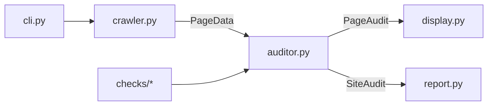

# SEObuddy Technical Manual

This document describes how SEObuddy is built, how data flows through the system, and how to extend or maintain it.

---

## Overview

SEObuddy is a **Python 3.11+** package distributed via `pyproject.toml` (Hatchling build). It exposes a **Typer** CLI that:

1. Validates and normalizes the seed URL.
2. **BFS-crawls** same-domain HTML pages with **httpx** (async).
3. **Audits** each page with **BeautifulSoup** + **lxml** and ten pluggable checks.
4. Renders **Rich** terminal UI and writes a **Markdown** report.



---

## Repository layout

```text
SEObuddy/
├── pyproject.toml          # dependencies, entry point, pytest config
├── README.md
├── docs/
│   ├── USER_MANUAL.md
│   ├── TECHNICAL_MANUAL.md
│   └── REPORT_EXAMPLE.md
├── src/seobuddy/
│   ├── __init__.py         # __version__
│   ├── __main__.py         # python -m seobuddy
│   ├── cli.py              # Typer app, asyncio orchestration
│   ├── crawler.py          # AsyncCrawler BFS
│   ├── auditor.py          # audit_page()
│   ├── models.py           # dataclasses
│   ├── url_utils.py        # normalize, domain, skip rules
│   ├── display.py          # Rich UI
│   ├── report.py           # Markdown generator
│   └── checks/
│       ├── base.py         # weights, scoring helpers
│       ├── title.py … technical.py
└── tests/
    ├── conftest.py
    ├── helpers.py
    └── test_*.py
```

---

## Entry points

| Mechanism | Target |
|-----------|--------|
| Console script `seobuddy` | `seobuddy.cli:app` |
| `python -m seobuddy` | `__main__.py` → `app()` |

### CLI orchestration (`cli.py`)

```python
async def _run_audit(url, config) -> SiteAudit:
    crawler = AsyncCrawler(config)
    async with httpx.AsyncClient(...) as link_client:
        with crawl_progress(...):
            async for page in crawler.crawl(url):
                if page.status_code == 0:
                    raise httpx.ConnectError(...)
                page_audit = await audit_page(page, context, config, link_client)
                site.pages.append(page_audit)
    site.report_path = write_report(site, config.output_dir)
    show_summary(console, site)
```

`asyncio.run()` wraps `_run_audit` from the Typer command. Connection failures on the seed fetch exit with code **1**.

---

## Core data models (`models.py`)

| Type | Purpose |
|------|---------|
| `AuditConfig` | CLI-derived settings (depth, max_pages, concurrency, timeout, paths, UA). Default UA: `DEFAULT_USER_AGENT` (Chrome 131 desktop) in `models.py` |
| `PageData` | Raw crawl result: URLs, status, headers, HTML, timing |
| `CheckResult` | Single category outcome: score, weight, status, findings, suggestions |
| `PageAudit` | One page’s full check map + weighted score |
| `SiteContext` | Cross-page state: seen titles, metas, canonicals, fetched URLs |
| `SiteAudit` | Full run: pages list, timing, `site_score` property |

`CheckStatus`: `pass` | `warn` | `fail` (derived from score thresholds in `base.status_from_score`).

---

## URL layer (`url_utils.py`)

### Crawl filtering (`url_utils.py`)

| Mechanism | Purpose |
|-----------|---------|
| `crawl_dedup_key(url)` | Visited set uses scheme + host + path (no query) |
| `is_crawlable_url(url)` | Gate before enqueue/fetch |
| `is_crawlable_path(path)` | Skip prefixes (`/cdn-cgi/`, `/intl/`), policy paths, `/ml`, binary extensions |
| Post-fetch check | Drop pages whose **final** URL after redirects is not crawlable |

Limits: query length ≤ 120 chars; path length ≤ 200 chars for crawl.

### `normalize_url(url, base=None) -> str | None`

- Resolves relative URLs via `urllib.parse.urljoin`.
- Allows only `http`/`https`.
- Lowercases host, strips fragment.
- Returns `None` for mailto, tel, javascript, data, empty, or **non-crawlable paths**.

### `is_crawlable_path(path)`

Skips CDN utility paths (v0.1: prefixes `/cdn-cgi/`) so Cloudflare email-protection URLs are not enqueued.

### `same_domain(url, seed_netloc)`

Compares netloc with `www.` stripped via `normalize_netloc`.

---

## Crawler (`crawler.py`)

### Class `AsyncCrawler`

| Parameter | Role |
|-----------|------|
| `config: AuditConfig` | Depth, concurrency, timeout, redirects, UA |
| `transport` | Optional `httpx.MockTransport` for tests |

### BFS algorithm

- Queue: `(url, depth)` tuples.
- Seed at depth `0`; enqueue discovered links only if `depth < config.depth`.
- Visited set stores **`crawl_dedup_key`** (path without query).
- Stops when **`pages_fetched >= config.max_pages`** (default 50); sets `crawl_capped`.
- Batch-dequeues up to `concurrency` URLs per wave; fetches with `asyncio.Semaphore`.

### Fetch behavior

- `User-Agent` header from `config.user_agent` (default `DEFAULT_USER_AGENT` — Chrome desktop string for site compatibility).
- `GET` with redirect following (`max_redirects` from config, default 5).
- `httpx.ConnectError` propagates (seed connection failure).
- Other `HTTPError` → `PageData` with `status_code=0` (CLI treats as failure on yield).
- HTML body stored for status &lt; 400; link extraction only when depth allows and content is HTML.

### `extract_internal_links(html, base_url, seed_netloc)`

Parses `<a href>`, normalizes, filters same-domain, returns list for queue.

### Async generator

```python
async def crawl(self, start_url) -> AsyncIterator[PageData]:
```

Yields each page as soon as its fetch (and queue updates) complete.

---

## Auditor (`auditor.py`)

```python
async def audit_page(page, context, config, client=None) -> PageAudit:
```

1. Parse HTML with `BeautifulSoup(..., "lxml")`.
2. If non-HTML or error status: stub checks with “No HTML content” except **technical** (still runs on URL/headers).
3. Run sync checks: title, meta, opengraph, jsonld, headings, content, images, canonical, technical.
4. Run **async** `links.check_async(..., client)`.
5. Compute `weighted_page_score(results)` and `path_display(final_url)`.

Checks mutate `SiteContext` (e.g. title/meta deduplication sets).

---

## Check modules (`checks/`)

Each module implements scoring per the product spec. Weights sum to **1.0**:

| Key | Weight | Module |
|-----|--------|--------|
| title | 0.15 | `title.py` |
| meta | 0.10 | `meta.py` |
| opengraph | 0.10 | `opengraph.py` |
| jsonld | 0.10 | `jsonld.py` |
| headings | 0.10 | `headings.py` |
| content | 0.15 | `content.py` |
| links | 0.10 | `links.py` |
| images | 0.10 | `images.py` |
| canonical | 0.05 | `canonical.py` |
| technical | 0.05 | `technical.py` |

### Scoring helpers (`base.py`)

- `clamp_score(value)` → int in [0, 100]
- `weighted_page_score(results)` → Σ(score × weight)
- `letter_grade(score)` → A/B/C+/C/D/F
- `aggregate_category_scores(pages)` → per-category mean + pages_ok (≥ 80)
- `top_issues(pages, limit=5)` → impact = weight × (100 − category_avg)
- `collect_recommendations(pages)` → deduplicated suggestions by impact

### Links check (async)

- Collects internal `<a href>` (max **20** unique probes per page).
- Skips URLs already in `context.fetched_urls`.
- `HEAD` first; `GET` fallback on 405.
- Broken: status 0 or ≥ 400.
- Penalizes generic anchor text (“click here”, “read more”, etc.).

### JSON-LD

Parses `script[type="application/ld+json"]`; validates `@type` and required fields for Organization, WebSite, Article variants.

### Content

Word count tiers: &lt;300 → 0; 300–499 → 60; 500–799 → 80; 800+ → 100. Combined with text/HTML ratio (target ≥ 15%).

---

## Display (`display.py`)

- `make_console(config)` — honors `--no-color`.
- `show_banner` (includes truncated User-Agent), `show_page_result`, `show_summary`, `show_error`.
- `crawl_progress` context manager → Rich `Progress` (spinner, URL, bar, task progress, elapsed).

No Rich markup in `cli.py` (separation of concerns).

---

## Report (`report.py`)

- `report_filename(hostname, when)` → `YYYYMMDDHHmm-hostname-report.md`
- `write_report(site, output_dir) -> Path`
- Markdown sections 1–4; page details use HTML `<details>` for collapsible blocks in compatible viewers.

---

## Dependencies

| Package | Role |
|---------|------|
| typer | CLI framework |
| httpx | Async HTTP client (+ HTTP/2 extra) |
| beautifulsoup4 | HTML parsing |
| lxml | Parser backend |
| rich | Terminal UI |

Dev: `pytest`, `pytest-asyncio` (`[project.optional-dependencies] dev`).

---

## Testing

```bash
source .venv/bin/activate
pip install -e ".[dev]"
pytest -q
```

| Test file | Coverage |
|-----------|----------|
| `test_checks_*.py` | Individual check logic |
| `test_checks_base.py` | Grading and weighted scores |
| `test_auditor.py` | Full page audit integration |
| `test_crawler.py` | URL normalize, link extract, mock transport BFS |
| `test_report.py` | Filename format and report sections |

`pyproject.toml`:

```toml
[tool.pytest.ini_options]
asyncio_mode = "auto"
testpaths = ["tests"]
pythonpath = ["tests"]
```

`tests/helpers.py` provides `make_soup()` and `page_with_html()` to avoid importing from `conftest`.

---

## Manual verification checklist

Run after changes:

```bash
pip install -e ".[dev]"
pytest -q
seobuddy https://nikitay.com --depth 2
seobuddy https://nikitay.com --depth 0
seobuddy https://nonexistent.invalid   # expect exit 1
```

**Note:** `https://niktiay.com` (typo) fails DNS — use `https://nikitay.com`.

Expected for nikitay.com:

- Terminal progress and per-page lines.
- Report file `*-nikitay.com-report.md` with four sections.
- No crash on invalid host (exit code 1).

---

## Extension points

### Add a new check

1. Create `src/seobuddy/checks/newcheck.py` with `check(soup, page, context) -> CheckResult`.
2. Add weight to `CATEGORY_WEIGHTS`, order in `CATEGORY_ORDER`, label in `CATEGORY_LABELS`.
3. Register in `auditor.py`.
4. Add `tests/test_checks_newcheck.py`.

### Customize crawl rules

- Extend `_SKIP_PATH_PREFIXES` in `url_utils.py`.
- Adjust BFS depth semantics in `AsyncCrawler.crawl` (document any change in both manuals).

### CI / headless

Use `--no-color` and a dedicated `--output-dir` for artifacts.

---

## HTML parsing (`html_utils.py`)

- `is_html_content(content_type, body)` — rejects XML/JSON/SVG and `<?xml` bodies.
- `parse_html(html, content_type)` — BeautifulSoup with `XMLParsedAsHTMLWarning` suppressed.
- Used by `auditor.py` and `crawler.extract_internal_links`.

---

## Known limitations (v0.1)

| Area | Limitation |
|------|------------|
| robots.txt | Not consulted |
| JavaScript rendering | Not executed; static HTML only |
| Rate limiting | User-controlled via `--concurrency` only |
| International SEO | No hreflang checks |
| Sitemap | Not used for discovery |
| Authentication | No support for logged-in pages |

---

## Build and packaging

- **Build backend:** Hatchling (`hatchling.build`).
- **Package path:** `src/seobuddy` (src layout).
- **Version:** `src/seobuddy/__init__.py` → `__version__`.

```bash
pip install -e .          # local development
pip install -e ".[dev]"   # + pytest
```

---

## Error handling matrix

| Condition | Implementation |
|-----------|----------------|
| Invalid URL scheme | `typer.BadParameter` in `_validate_url` |
| DNS / connection | `httpx.ConnectError` from crawler or CLI guard on status 0 |
| Timeout | `httpx.TimeoutException` caught in CLI |
| HTTP 4xx/5xx | Page still yielded if crawl reached it; HTML may be empty; checks reflect failure |
| SSL errors | Surfaced via httpx exception chain |
| Redirects | `final_url` used for canonical, technical HTTPS, display path |

---

## Version

Document version aligns with package **v0.1.0**.

For user-facing instructions see [USER_MANUAL.md](USER_MANUAL.md). Sample output: [REPORT_EXAMPLE.md](REPORT_EXAMPLE.md).

---

Copyright © 2026 [NikitaY.com](https://nikitay.com/). Created by [NikitaY.com](https://nikitay.com/).
